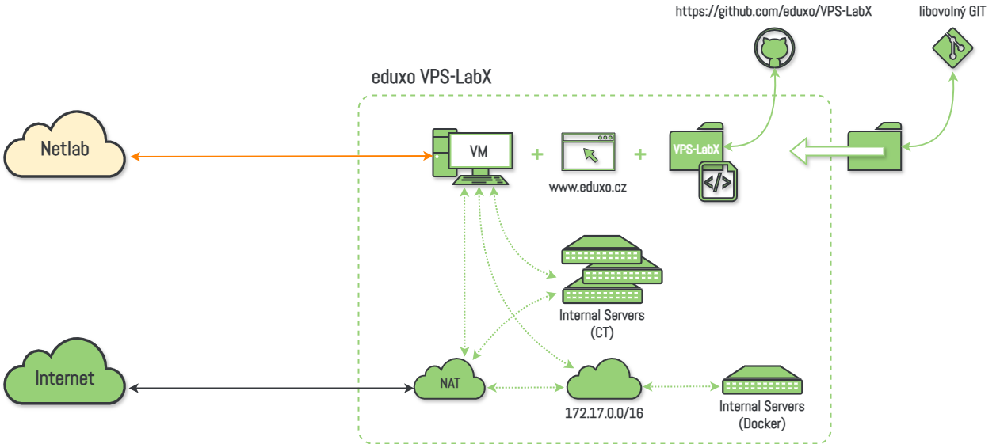

# Co je VPS-LabX?

**Přenositelné virtuální prostředí, ve kterém je možné vytvářet, spouštět a sdílet různé úlohy a cvičení.**

<figure><figcaption>...</figcaption></figure>

***

Jedná se o multifunkční virtuální laboratoř, která umožňuje studentům provádět praktická cvičení a experimenty v rámci informačních sítí, operačních systémů a kybernetické bezpečnosti. Tato platforma je postavena zejména na otevřených nástrojích a je dostupná zdarma, což z ní činí ideálního partnera pro studenty, kteří chtějí zlepšit své IT dovednosti.

Jako základ pro **VPS-LabX** posloužil systém [Proxmox](https://www.proxmox.com/en/) postavený na stabilní linuxové distribuci [Debian](https://www.debian.org/). Uživatelsky přívětivé grafické rozhraní [Gnome](https://www.gnome.org/) pak činí práci se systémem komfortnější.

### Co VPS-LabX nabízí?

1. **Vytváření VPS (Virtual Private Server)**: Snadno a rychle vytvářejte virtuální stroje s různými "linux-based" operačními systémy a konfiguracemi podle svých potřeb. To znamená, že máte plnou kontrolu nad tím, jaké prostředí si vytvoříte pro svá cvičení a experimenty.
2. **Experimenty a cvičení**: Jeden z hlavních důvodů, proč zvolit **VPS-LabX**, je možnost provádět cvičení a experimenty ve virtuálním prostředí. Bez rizika ztráty dat nebo negativního vlivu na reálný provoz mohou studenti testovat různé scénáře a získat tak cenné praktické zkušenosti.
3. **Flexibilita a bezpečnost**: **VPS-LabX** poskytuje flexibilitu vytvářet a spravovat virtuální stroje podle svých potřeb, zatímco zajišťuje izolaci a bezpečnost. To znamená, že můžete experimentovat a testovat různé konfigurace a přístupy bez obav o bezpečnostní rizika.

## Jak získat VPS-LabX?

### Vytvoření vlastní stanice

Pokud máte zájem o **VPS-LabX**, lze si ji snadno připravit v několika málo krocích.

#### 1. krok: Stažení a instalace Proxmox VE

Proxmox VE (Virtual Environment) je open-source nástroj pro virtualizaci serverů. To znamená, že umožňuje spouštět na jednom fyzickém serveru více virtuálních serverů, což šetří hardware a energii. Proxmox VE podporuje dvě virtualizační technologie:

* KVM (Kernel-based Virtual Machine) pro virtualizaci celých operačních systémů
* LXC (Linux Containers) pro virtualizaci aplikací

Proxmox VE má jednoduché webové rozhraní, které umožňuje správu virtuálních serverů, kontejnerů, úložiště a sítě. Může být také použit k vytváření clusterů serverů pro vysokou dostupnost.

Tento krok: stažení a instalaci systému Proxmox, necháme zcela na vás. Následují pouze naše doporučení k instalaci, která zajistí optimální funkčnost systému.

**Stažení ...**

Operační systém Proxmox VE si můžete stáhnout z odkazu: https://www.proxmox.com/en/downloads/proxmox-virtual-environment

**Instalace ...**

Nyní si systém stačí nainstalovat např. do VirtualBoxu, VMware, Hyper-V, apod., nebo přímo na nějaký váš hardware.

```
+---------------------- MINIMUM ----------------------+
|    Host System:           64-bit x86 System         |
|    Memory:                4 GB RAM                  |
|    Number of Processors:  2                         |
|    Free Disk Space:       60 GB Hard Disk           |
+-----------------------------------------------------+

+-------------------- RECOMMENDED --------------------+
|    Host System:           64-bit x86 System         |
|    Memory:                16 GB RAM                 |
|    Number of Processors:  4                         |
|    Free Disk Space:       100 GB Hard Disk          |
+-----------------------------------------------------+
```

Při instalaci budete muset zadat pár základních informací. Naše doporučení jsou následující, avšak rozhodnutí je zcela na vás:

**Country:** Czechia\
**Time zone:** Europe/Prague\
**Keyboard Layout:** U.S. English\
**Password:** Netlab!23\
**E-mail:** mail@eduxo.lab\
**Hostname:** VPS-LabX.localhost\
**IP Adressing:** veškeré volby spojené s IP adresou ponechte nastavená tak jak vám byli přiřazeny z DHCP serveru

Po dokončení instalace se stanice sama restartuje.

Po restartu se přihlaste pomocí údajů:

```
VPS-LabX login: root
Password: Netlab!23 (nebo vámi nastavené heslo při instalaci)
```

Otestujte připojení k internetu:

```
root@VPS-LabX:~# ping 1.1.1.1 -c 4

PING 1.1.1.1 (1.1.1.1) 56(84) bytes of data.
64 bytes from 1.1.1.1 icmp_seq=1 ttl=54 time=10.0ms
64 bytes from 1.1.1.1 icmp_seq=1 ttl=54 time=9.37ms
64 bytes from 1.1.1.1 icmp_seq=1 ttl=54 time=8.09ms
64 bytes from 1.1.1.1 icmp_seq=1 ttl=54 time=6.33ms

--- 1.1.1.1 ping statistics ---
4 packets transmited, 4 received, 0% packet loss, time 3005ms
rtt min/avg/max/mdev = 6.328/8.446/9.996/1.402 ms
```

#### 2. krok: Spuštění skriptu `init.sh`

Po přihlášení do systému stačí spustit v příkazové řádce následující příkaz :

```bash
wget https://raw.githubusercontent.com/eduxo/vps-labx/main/init.sh && bash init.sh
```

<mark style="color:red;">Pohodlně se usaďte s šálkem dobré kávy a počkejte, až se dokončí instalace všech nástrojů.</mark>

#### 3. krok: Personalizace VPS-LabX

Nyní můžete nastavit stanici dle vlastních preferencí.

***

### Stažení VM pro VirtualBox

Pozor, předpřipravená stanice nemusí být vždy aktuální.

Jednou z možností je stáhnout si **VPS-LabX** jako sobor OVA pro import do VirtualBoxu.

Při importu VM není třeba provádět žádné změny v nastavení VirtualBoxu.

[**Stáhnout VPS-LabX**](https://drive.google.com/drive/folders/1A_opDISoGS34Qv2K3pXFpJlER598i9vg?usp=drive_link)
