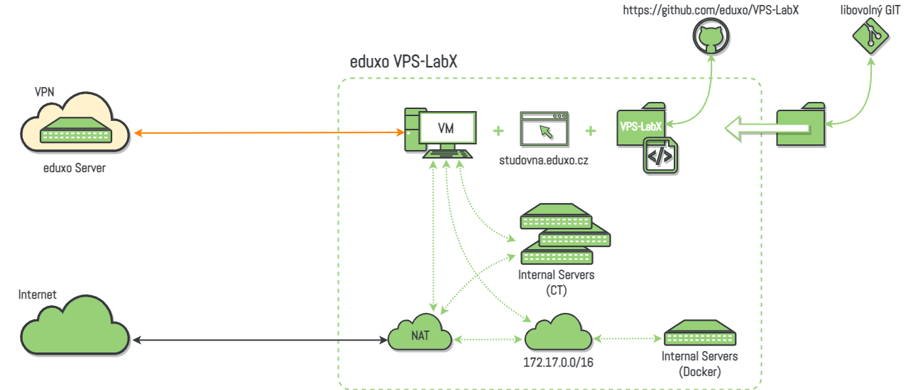

# VPS-LabX

<figure><figcaption></figcaption></figure>

"**eduxo VPS-LabX**" je přenositelná virtuální laboratoř sestavená s ohledem na potřeby studentů a jejich zájem o informační sítě, operační systémy a kybernetickou bezpečnost.

Tato laboratoř je založena na otevřených nástrojích a nekomerčním přístupu k vzdělávání a přichází jako nástupce původního "**eduxo Workstation**" .

Přináší s sebou celou řadu inovací a ve spojení s "[**eduxo Studovnou**](https://eduxo.cz/eduxo-studovna/)" , tvoří komplexní vzdělávací ekosystém pro studenty a nadšence v oblasti informačních technologií. Není jenom výukovým nástrojem, ale i praktickým cvičební prostorem, kde můžete zkoumat, experimentovat a zdokonalovat své IT dovednosti.

## Co je eduxo VPS-LabX?

Jedná se o multifunkční virtuální laboratoř, která umožňuje studentům provádět praktická cvičení a experimenty v rámci informačních sítí, operačních systémů a kybernetické bezpečnosti. Tato platforma je postavena zejména na otevřených nástrojích a je dostupná zdarma, což z ní činí ideálního partnera pro studenty, kteří chtějí zlepšit své IT dovednosti.

Jako základ pro "**eduxo VPS-LabX**" posloužil systém [Proxmox](https://www.proxmox.com/en/) postavený na stabilní linuxové distribuci [Debian](https://www.debian.org/). Uživatelsky přívětivé grafické rozhraní [Gnome](https://www.gnome.org/) pak činí práci se systémem komfortnější. V rámci předinstalovaných aplikací lze mimo jiné najít i program Packet Tracer od společnosti Cisco. Pro použití tohoto nástroje je potřeba mít účet v [NetAcad.com](https://www.netacad.com/).

## Co eduxo VPS-LabX nabízí?

1. **Vytváření VPS (Virtual Private Server)**: Snadno a rychle vytvářejte virtuální stroje s různými "linux-based" operačními systémy a konfiguracemi podle svých potřeb. To znamená, že máte plnou kontrolu nad tím, jaké prostředí si vytvoříte pro svá cvičení a experimenty.
2. **Experimenty a cvičení**: Jeden z hlavních důvodů, proč zvolit "**eduxo VPS-LabX**" , je možnost provádět cvičení a experimenty ve virtuálním prostředí. Bez rizika ztráty dat nebo negativního vlivu na reálný provoz mohou studenti testovat různé scénáře a získat tak cenné praktické zkušenosti.
3. **Flexibilita a bezpečnost**: "**eduxo VPS-LabX**" poskytuje flexibilitu vytvářet a spravovat virtuální stroje podle svých potřeb, zatímco zajišťuje izolaci a bezpečnost. To znamená, že můžete experimentovat a testovat různé konfigurace a přístupy bez obav o bezpečnostní rizika.
4. **Výukové materiály**: Pro studenty jsou v [**eduxo Studovně**](https://eduxo.cz/eduxo-studovna/) k dispozici výukové materiály a cvičení, které jim pomohou lépe porozumět různým IT tématům. Díky nim mohou lépe pochopit, jak fungují informační sítě, operační systémy a kybernetická bezpečnost.
5. **Neustálý rozvoj**: "**eduxo VPS-LabX**" bude průběžně aktualizována a rozvíjena tak, aby studentům poskytla další nástroje a technologie, které jim pomohou lépe porozumět různým IT konceptům a rychleji získávat potřebné dovednosti.

Celkově lze říci, že "**eduxo VPS-LabX**" je nástrojem, který studentům umožňuje stát se aktivními účastníky svého vlastního vzdělávání v oblasti informačních technologií a kybernetické bezpečnosti.

## Pro koho je eduxo VPS-LabX?

"**eduxo VPS-LabX**" nabízí širokou škálu možností pro praktickou výuku v oblasti informačních technologií a kybernetické bezpečnosti. Můžete se zaměřit na následující oblasti:

* administrace pracovní stanice Linux,
* administrace serveru Linux,
* zabezpečení systémů Linux,
* správa síťových služeb Linux,
* úvod do počítačových sítí,
* switching (přepínání) a routing (směrování),
* bezpečnost v počítačových sítí,
* správa a dohled nad počítačovou sítí,
* diagnostika počítačové sítě,
* návrh počítačové sítě,
* kryptografie,
* bezpečnost sítí a služeb,
* detekce a prevence síťových útoků,
* testování bezpečnosti.

Je důležité si uvědomit, že "**eduxo VPS-LabX**" je zaměřeno na Linux a kybernetickou bezpečnost. To znamená, že nepokrývá oblasti spojené s administrací pracovní stanice Windows, administrací serveru Windows a zabezpečením systémů Windows. Pokud máte zájem o tyto oblasti, budete potřebovat jiný prostředek pro svou výuku.
