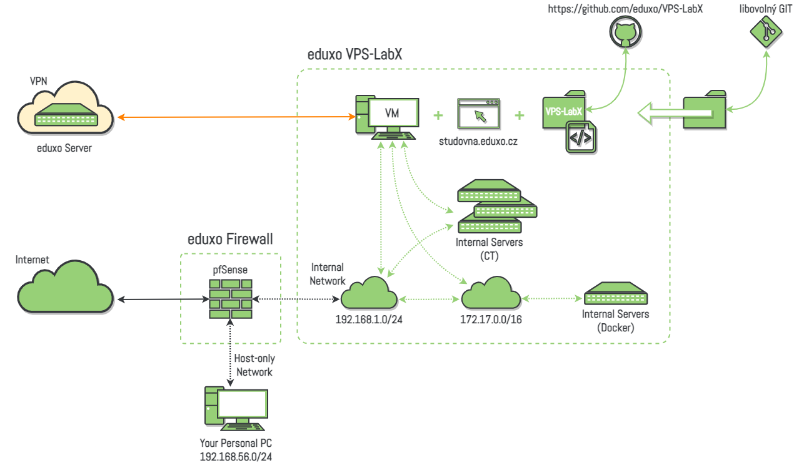
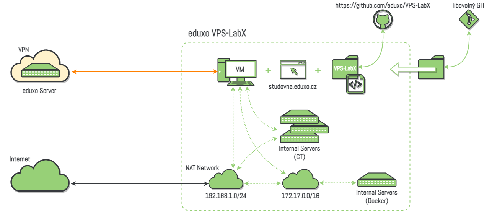
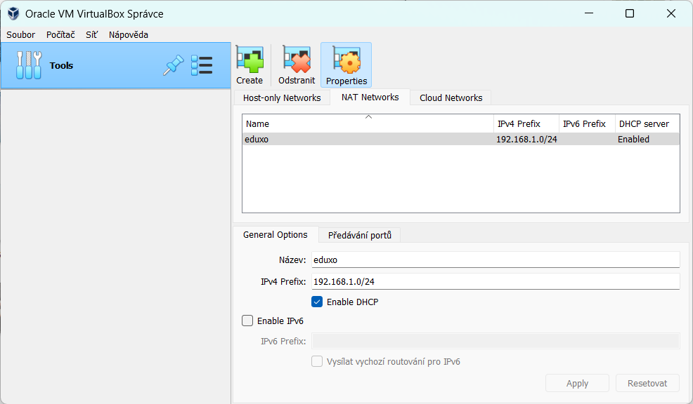
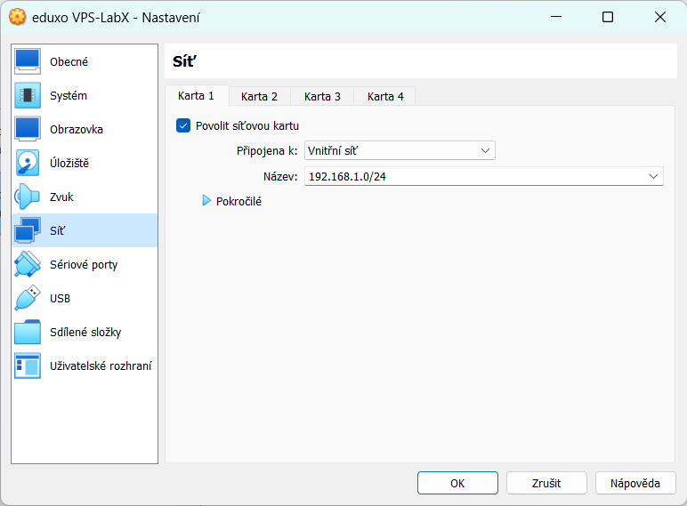
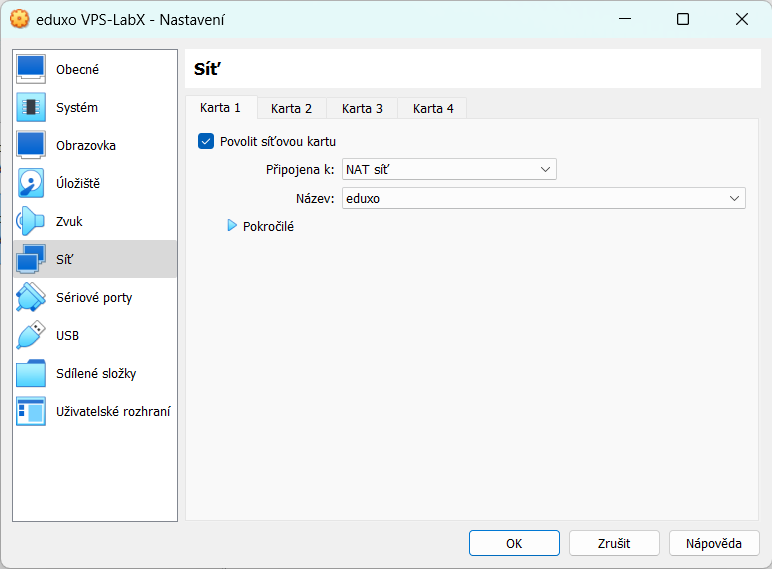

# Jak získat eduxo VPS-LabX?

Pokud máte zájem o „**eduxo VPS-LabX**“ , můžete si jej snadno stáhnout jako sobory OVA pro import do VirtualBoxu. Laboratoř je rozdělena do dvou virtuálních stanic (VM): hlavního „**eduxo\_VPS-LabX.ova**“ a doplňkového „**eduxo\_Firewall.ova**“ .

## eduxo VPS-LabX + Firewall

Při importu obou těchto VM není třeba provádět žádné změny v nastavení VirtualBoxu. Pro správnou funkčnost je však nutné mít vždy zapnuté obě VM. Při použití obou VM získáte možnost propojení s vaším hostitelským počítačem. Virtuální stanice „**eduxo\_Firewall**“ je navíc využívána pro některá cvičení.

<figure><figcaption></figcaption></figure>

## eduxo VPS-LabX

Pokud se rozhodnete importovat pouze „**eduxo\_VPS-LabX.ova**“ , bude zapotřebí provést určitou úpravu nastavení síťové karty této VM. Následující obrázky vám ukážou, jak tuto úpravu provést krok za krokem.

<figure><figcaption></figcaption></figure>

Jak můžete vidět z obrázku, bude potřeba nejprve vytvořit ve VirtualBoxu novou „**NAT Network**“ s adresací „**192.168.1.0/24**„. Následující obrázek ukazuje jak by mělo nastavení ve vašem VirtualBoxu vypadat.

<figure><figcaption></figcaption></figure>

Po importu VM „**eduxo\_VPS-LabX.ova**“ vstupte do nastavení VM. Nastavení síťové karty by mělo vypadat následovně.

<figure><figcaption></figcaption></figure>

Toto nastavení je potřeba upravit následovně.

<figure><figcaption></figcaption></figure>

**Hotovo!** Nyní je vše připraveno a vy můžete začít naplno využívat výukové možnosti „**eduxo VPS-LabX**„

Máte-li nějaké dotazy nebo potřebujete pomoc s instalací a používáním, neváhejte se obrátit přímo na mě, nebo na naši komunitu a sdílet své zkušenosti s ostatními studenty.

## Stáhnout VPS-LabVPS-LabX
